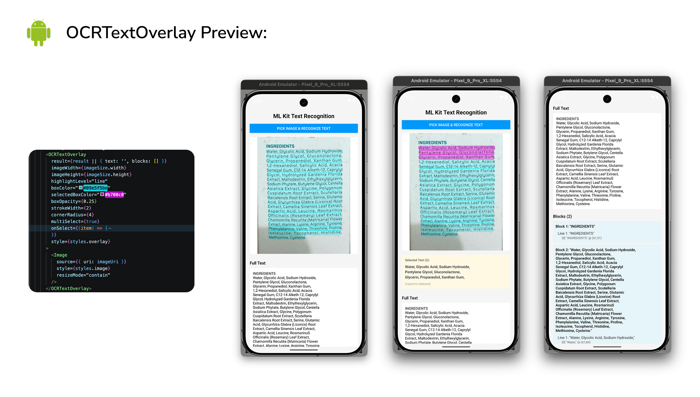
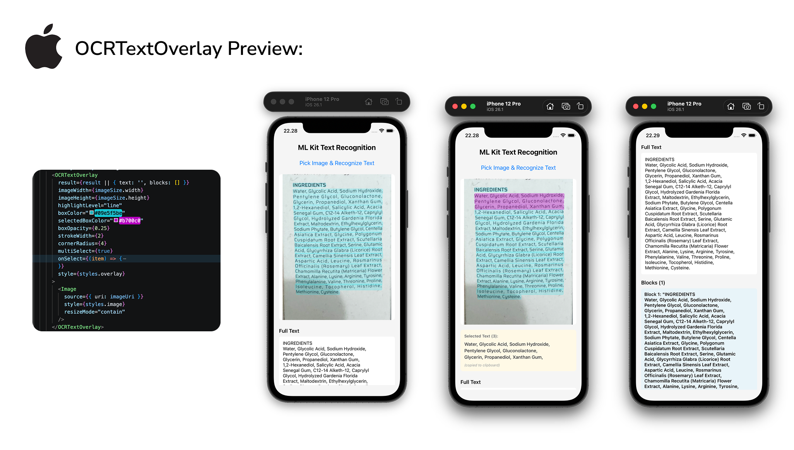

# expo-mlkit-ocr

Production-ready Expo Module for on-device text recognition (OCR) using **Google ML Kit Text Recognition v2** for both iOS and Android.

## Preview

<div align="center">
  
  
</div>

## Features

- ✅ **On-device OCR** — no network requests required
- ✅ **ML Kit v2** — official Google ML Kit standalone (not Firebase ML Kit)
- ✅ **Structured output** — blocks, lines, and elements with bounding boxes
- ✅ **iOS & Android** — native implementations using Expo Modules API
- ✅ **TypeScript support** — fully typed API
- ✅ **Expo Config Plugin** — automatic native setup
- ✅ **Interactive overlay** — `<OCRTextOverlay>` component for visualizing & selecting recognized text

## Installation

```bash
npx expo install expo-mlkit-ocr expo-image-picker
```

## Setup

### With EAS Build

Add the plugin to your `app.json`:

```json
{
  "expo": {
    "plugins": [
      [
        "expo-mlkit-ocr",
        {
          "iosEngine": "auto"
        }
      ]
    ]
  }
}
```

Then run:

```bash
eas build --platform ios
eas build --platform android
```

### Development (Local Prebuild)

To test locally with a development client:

```bash
npx expo prebuild --clean
npx expo run:ios
# or
npx expo run:android
```

## Usage

### Basic Example

```typescript
import { recognizeText } from 'expo-mlkit-ocr';
import * as ImagePicker from 'expo-image-picker';

async function pickAndRecognize() {
  const result = await ImagePicker.launchImageLibraryAsync({
    mediaTypes: ['images'],
  });

  if (result.canceled || !result.assets[0]) return;

  try {
    const recognition = await recognizeText(result.assets[0].uri);
    console.log('Recognized text:', recognition.text);
    console.log('Blocks:', recognition.blocks);
  } catch (error) {
    console.error('Recognition failed:', error);
  }
}
```

### Output Format

The function returns a `RecognitionResult` object with this structure:

```typescript
export type RecognitionResult = {
  text: string; // Full recognized text
  blocks: TextBlock[];
};

export type TextBlock = {
  text: string;
  boundingBox: {
    x: number;
    y: number;
    width: number;
    height: number;
  };
  lines: TextLine[];
};

export type TextLine = {
  text: string;
  boundingBox: {
    x: number;
    y: number;
    width: number;
    height: number;
  };
  elements: TextElement[];
};

export type TextElement = {
  text: string;
  boundingBox: {
    x: number;
    y: number;
    width: number;
    height: number;
  };
};
```

**Bounding box coordinates** are in the image's native coordinate system (top-left origin):
- `x`, `y` — top-left corner
- `width`, `height` — dimensions in pixels

### Example Output

```json
{
  "text": "Hello World\nExample Text",
  "blocks": [
    {
      "text": "Hello World",
      "boundingBox": { "x": 100, "y": 50, "width": 200, "height": 50 },
      "lines": [
        {
          "text": "Hello World",
          "boundingBox": { "x": 100, "y": 50, "width": 200, "height": 50 },
          "elements": [
            {
              "text": "Hello",
              "boundingBox": { "x": 100, "y": 50, "width": 80, "height": 50 }
            },
            {
              "text": "World",
              "boundingBox": { "x": 190, "y": 50, "width": 110, "height": 50 }
            }
          ]
        }
      ]
    }
  ]
}
```

## API Reference

### `recognizeText(uri: string): Promise<RecognitionResult>`

Recognizes text from an image at the provided URI.

**Parameters:**
- `uri` (string) — file URI or content URI to the image (e.g., from `expo-image-picker`)

**Returns:**
- `Promise<RecognitionResult>` — structured text recognition result

**Errors:**
- `INVALID_URI` — provided URI is not valid
- `IMAGE_LOAD_FAILED` — image could not be loaded from the URI
- `RECOGNITION_FAILED` — text recognition failed (rare)

### `<OCRTextOverlay />` — Interactive Bounding Box Overlay

Renders interactive bounding boxes over an image to visualize OCR results. Tap boxes to select text and trigger a callback (e.g., copy to clipboard).

**Usage:**

```typescript
import { recognizeText, OCRTextOverlay } from 'expo-mlkit-ocr';
import { Image, Clipboard } from 'react-native';
import { useState } from 'react';

export default function App() {
  const [result, setResult] = useState(null);

  async function pickAndRecognize() {
    const picked = await ImagePicker.launchImageLibraryAsync({ mediaTypes: ['images'] });
    if (!picked.assets[0]) return;

    const asset = picked.assets[0];
    const ocrResult = await recognizeText(asset.uri);
    setResult(ocrResult);
  }

  return (
    <>
      <Button title="Pick & Recognize" onPress={pickAndRecognize} />

      {result && (
        <OCRTextOverlay
          result={result}
          imageWidth={picked.assets[0].width}
          imageHeight={picked.assets[0].height}
          highlightLevel="line"
          onSelect={(item) => Clipboard.setString(item.text)}
        >
          <Image source={{ uri: picked.assets[0].uri }} style={{ width: 300, height: 400 }} />
        </OCRTextOverlay>
      )}
    </>
  );
}
```

**Props:**

| Prop | Type | Default | Description |
|------|------|---------|-------------|
| `result` | `RecognitionResult` | — | OCR result from `recognizeText()` |
| `imageWidth` | `number` | — | Native image width (pixels) |
| `imageHeight` | `number` | — | Native image height (pixels) |
| `children` | `ReactNode` | — | Image component to wrap |
| `highlightLevel` | `'block' \| 'line' \| 'element'` | `'line'` | Which level to highlight |
| `resizeMode` | `'contain' \| 'cover'` | `'contain'` | Image resize behavior |
| `boxColor` | `string` | `'#00BFFF'` | Box border & fill color (hex) |
| `selectedBoxColor` | `string` | `'#FF6347'` | Color when a box is selected |
| `boxOpacity` | `number` | `0.25` | Fill opacity (0–1) |
| `strokeWidth` | `number` | `2` | Border width (pixels) |
| `cornerRadius` | `number` | `4` | Rounded corner radius (pixels) |
| `multiSelect` | `boolean` | `true` | Allow selecting multiple boxes |
| `onSelect` | `(item) => void` | — | Callback when box(es) are tapped (single item or array) |
| `style` | `ViewStyle` | — | Optional wrapper style |

**Multi-Select Example:**

```typescript
// Single selection (one box at a time)
<OCRTextOverlay
  result={result}
  imageWidth={1920}
  imageHeight={1080}
  multiSelect={false}  // Only one selection
  onSelect={(item) => console.log('Selected:', item.text)}
>
  <Image source={{ uri }} />
</OCRTextOverlay>

// Multiple selection (tap multiple boxes)
<OCRTextOverlay
  result={result}
  imageWidth={1920}
  imageHeight={1080}
  multiSelect={true}  // Default - allow multiple selections
  onSelect={(items) => {
    if (Array.isArray(items)) {
      console.log('Selected items:', items.map(i => i.text).join(', '));
    } else {
      console.log('Single item:', items.text);
    }
  }}
>
  <Image source={{ uri }} />
</OCRTextOverlay>
```

**Highlights:**
- ✅ Pure React Native (no external canvas library)
- ✅ Tap to toggle selection + visual highlight
- ✅ Multi-select mode: tap multiple boxes, all stay highlighted
- ✅ Single-select mode: only one box highlighted at a time
- ✅ Works with any `<Image>` component (react-native, expo-image, etc.)
- ✅ Automatic coordinate scaling for `contain` and `cover` resize modes
- ✅ Full TypeScript support

## Common Errors

### `Error: expo-mlkit-ocr is not supported on web.`

The module only works on iOS and Android. For web support, use a third-party OCR service (e.g., Tesseract.js).

```typescript
import { Platform } from 'react-native';
import { recognizeText } from 'expo-mlkit-ocr';

if (Platform.OS !== 'web') {
  const result = await recognizeText(uri);
} else {
  // Use a web-based OCR service
}
```

### `IMAGE_LOAD_FAILED`

- Ensure the URI is valid and the file exists
- Use URIs from `expo-image-picker` or `expo-camera` which are guaranteed to work
- On Android, both `file://` and `content://` URIs are supported

### iOS Simulator (arm64) + iOS 26.x

Google ML Kit CocoaPods binaries exclude the `ios-arm64-simulator` slice, so arm64-only simulator runtimes (for example iOS 26.x on Apple Silicon) can’t link ML Kit frameworks and will fail at build/link time.

To keep development on simulator unblocked, `expo-mlkit-ocr` supports **Apple Vision** as a fallback OCR engine on iOS. The **JavaScript response shape stays the same** (`text`, `blocks`, `lines`, `elements`, `boundingBox`); only the underlying OCR engine changes.

```json
{
  "expo": {
    "plugins": [
      ["expo-mlkit-ocr", { "iosEngine": "vision" }]
    ]
  }
}
```

Supported `iosEngine` values:
- `"auto"` (default): use Apple Vision (simulator-friendly default)
- `"mlkit"`: use Google ML Kit (won’t build on arm64-only iOS Simulator runtimes)
- `"vision"`: always use Apple Vision (disables ML Kit pods)

Legacy option (equivalent to `iosEngine: "vision"`):
- `disableMlkitOnSimulator: true`

## Development

### Project Structure

```
expo-mlkit-ocr/
├── src/                          # TypeScript source
│   ├── index.ts
│   ├── ExpoMlkitOcr.types.ts
│   ├── ExpoMlkitOcrModule.ts
│   ├── ExpoMlkitOcrModule.web.ts
│   └── OCRTextOverlay.tsx        # Interactive overlay component
├── ios/
│   ├── ExpoMlkitOcrModule.swift   # ML Kit integration
│   └── ExpoMlkitOcr.podspec
├── android/
│   ├── build.gradle
│   └── src/main/java/.../ExpoMlkitOcrModule.kt
├── app.plugin.js                 # Expo config plugin entry
├── plugins/
│   └── withMlkitSimulatorArm64Fix.js
├── example/                      # Example app
│   ├── App.tsx
│   └── app.json
└── expo-module.config.json
```

### Building from Source

```bash
# Install dependencies
npm install

# Build the module (src/ → build/)
npm run prepare

# Open the example app (iOS)
npm run open:ios

# Or run the example app with Expo CLI
cd example
npx expo start

# Scan QR code with Expo Go or run on device/simulator
```

### Running the Example App

The example app at `example/` demonstrates:
1. Picking an image from the device library
2. Running OCR with `recognizeText()`
3. Displaying the results (full text, blocks, lines, elements)

## License

MIT

## Contributing

Contributions are welcome! Please ensure:
- TypeScript code compiles without errors
- Native code follows platform conventions
- Example app works on both iOS and Android

## References

- [ML Kit Text Recognition (v2) — iOS](https://developers.google.com/ml-kit/vision/text-recognition/v2/ios)
- [ML Kit Text Recognition (v2) — Android](https://developers.google.com/ml-kit/vision/text-recognition/v2/android)
- [Expo Modules API](https://docs.expo.dev/modules/get-started/)

Made with ❤️ by [rbayuokt](https://github.com/rbayuokt)
